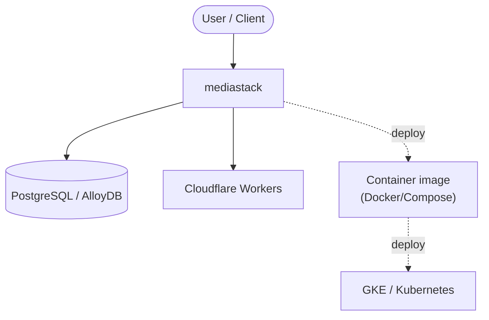

# Context Map — `mediastack`

> Auto-generated architecture & deployment context map. Summarizes the core application, container/cloud footprint, and database connections. Regenerate after significant structural changes.

**Repo:** `avnit/mediastack` · **Fork** · Public · Primary language: Shell · Default branch: `master` · Files: 105

**Description:** The ultimate Docker Compose files and configs to build your desired media stack, quickly and easily, with secure outbound network traffic and secure remote access using multifactor authentication.

## 1. Core application

MediaStack Project (Docker)

- **Listens on port(s):** 80, 3000, 5432, 41641

## 2. Containers & cloud applications

**Containers:**
- `archived-old-configs/full-vpn_multiple-yaml/docker-compose-authelia.yaml`
- `archived-old-configs/full-vpn_multiple-yaml/docker-compose-bazarr.yaml`
- `archived-old-configs/full-vpn_multiple-yaml/docker-compose-ddns-updater.yaml`
- `archived-old-configs/full-vpn_multiple-yaml/docker-compose-filebot.yaml`
- `archived-old-configs/full-vpn_multiple-yaml/docker-compose-flaresolverr.yaml`
- `archived-old-configs/full-vpn_multiple-yaml/docker-compose-gluetun.yaml`
- `archived-old-configs/full-vpn_multiple-yaml/docker-compose-heimdall.yaml`
- `archived-old-configs/full-vpn_multiple-yaml/docker-compose-homarr.yaml`
- `archived-old-configs/full-vpn_multiple-yaml/docker-compose-homepage.yaml`
- `archived-old-configs/full-vpn_multiple-yaml/docker-compose-jellyfin.yaml`
- `archived-old-configs/full-vpn_multiple-yaml/docker-compose-jellyseerr.yaml`
- `archived-old-configs/full-vpn_multiple-yaml/docker-compose-lidarr.yaml`

**Detected cloud platforms / services:** GKE / Kubernetes, Cloudflare Workers, Terraform

## 3. Database connections

**Datastores in use:** PostgreSQL / AlloyDB

**Environment / config files:** `archived-old-configs/full-vpn_multiple-yaml/docker-compose.env`, `archived-old-configs/full-vpn_single-yaml/docker-compose.env`, `archived-old-configs/min-vpn_mulitple-yaml/docker-compose.env`, `archived-old-configs/min-vpn_single-yaml/docker-compose.env`, `base-working-files/.env`, `full-download-vpn/.env.template`, `full-download-vpn/homepage.env`

> ⚠️ Non-template env files are committed: `archived-old-configs/full-vpn_multiple-yaml/docker-compose.env`, `archived-old-configs/full-vpn_single-yaml/docker-compose.env`, `archived-old-configs/min-vpn_mulitple-yaml/docker-compose.env`, `archived-old-configs/min-vpn_single-yaml/docker-compose.env`, `base-working-files/.env`, `full-download-vpn/homepage.env`. Verify no live secrets are tracked.

## 4. Architecture diagram

## 5. Security posture

- No open Dependabot alerts or static-scan findings recorded.

---
_Generated by repo context-mapping pass on 2026-08-13._